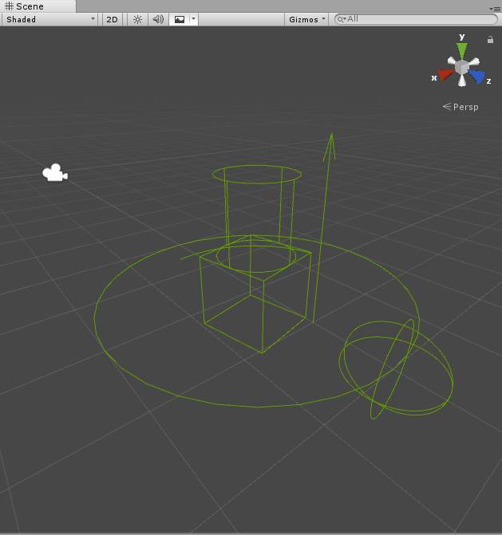

# GizmoExtensions
Utility class(es) that extend Unity's Gizmos

## Features

* adds `Quaternion rotation` as an input parameter for the primitive types
* adds Circles, Cylinders, Arcs and Arrows to the Gizmos

## Install
Just drop the `/src` folder into your Unity Assets

## Contribute
Do you have any Gizmo extensions? Feel free to contribute !
